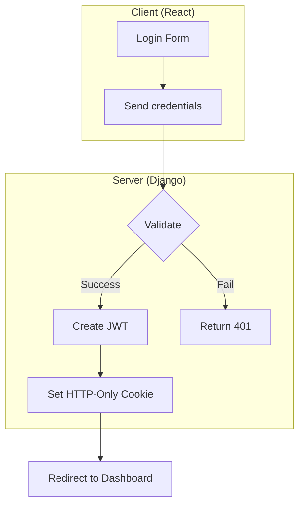
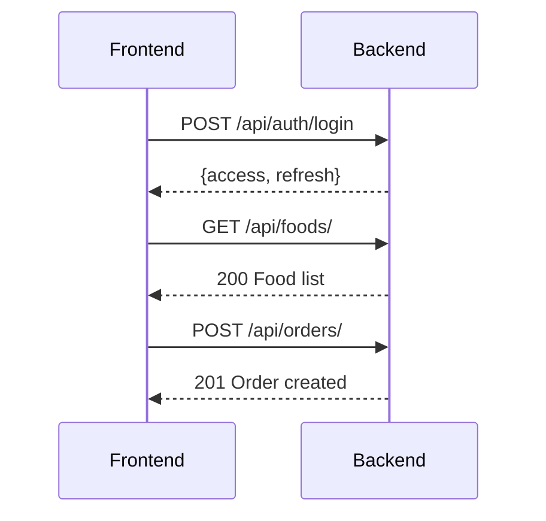
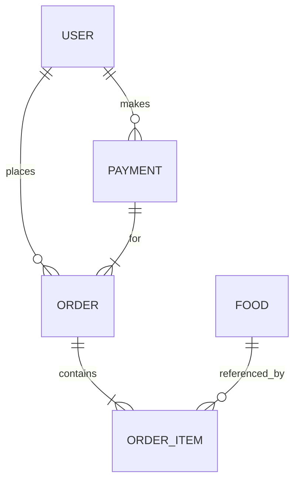
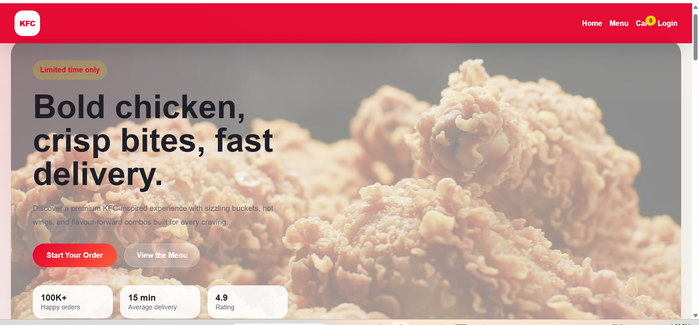
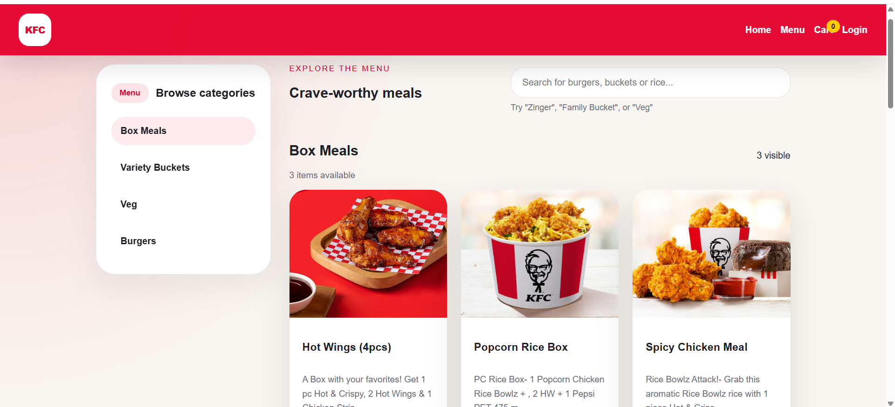
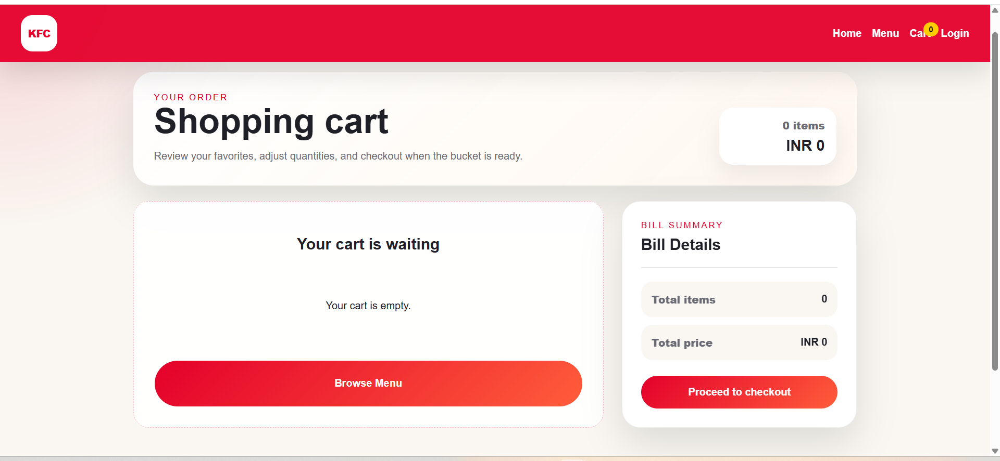
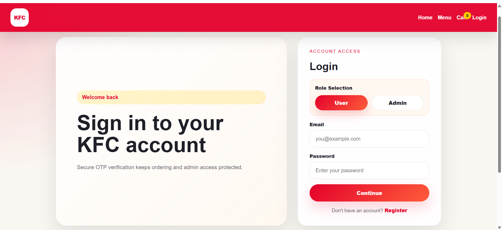
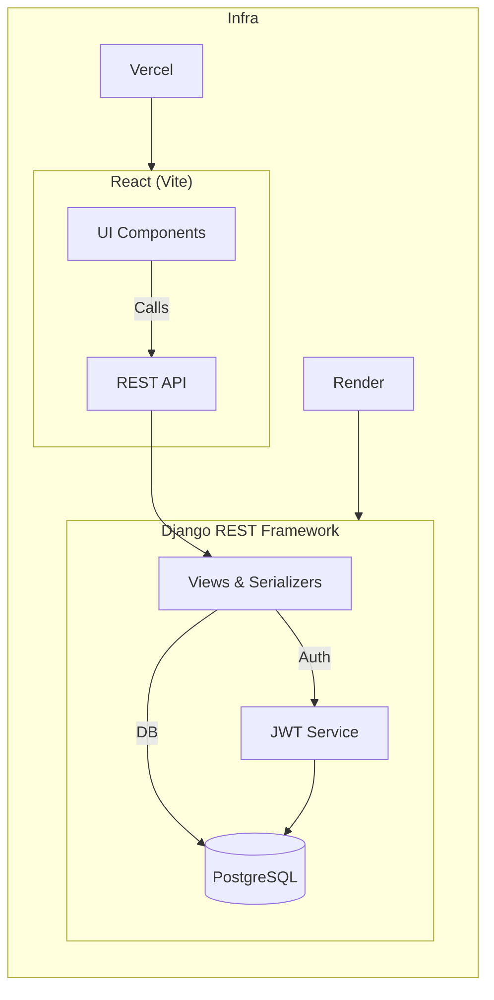

# <p align="center"> <strong>KFC Clone Full Stack Food Ordering App</strong> </p>

---

<div align="center">
  <a href="https://github.com/yourusername/kfc-clone"></a>
  <a href="https://github.com/yourusername/kfc-clone/network/members"></a>
  <a href="https://github.com/yourusername/kfc-clone/blob/main/LICENSE"></a>
  <a href="https://vercel.com"></a>
  <a href="https://render.com"></a>
</div>

---

## 📖 Hero Banner
<p align="center">
  
</p>

---

## 📚 Project Overview
A **full‑stack, production‑grade** food‑ordering web application that mimics the experience of ordering from **KFC**.  It showcases a modern **React + Vite** frontend, a **Django + DRF** backend, **JWT** authentication, and CI/CD pipelines powered by **GitHub Actions**, deployed on **Vercel** (frontend) and **Render** (backend).

---

## 🌐 Live Demo
| Platform | Link |
|----------|------|
| Frontend (Vercel) | https://kfc-clone-frontend.vercel.app |
| Backend (Render) | https://kfc-clone-backend.onrender.com |

---

## ✨ Features
- 🍗 **Restaurant‑style menu** with dynamic pricing
- 🛒 **Cart & checkout** powered by Stripe (placeholder)
- 🔐 **JWT‑based authentication** (sign‑up, login, password reset)
- 👤 **User dashboard** – order history, profile management
- 🛠️ **Admin dashboard** – CRUD for foods, orders, payments, users
- 📊 **Real‑time order processing** visualisation
- 📦 **Dockerised** runtime for both services
- 🤖 **CI/CD** – lint, test, build, and deploy automatically

---

## 🔐 Authentication Flow


---

## 📊 Admin Dashboard Features
- **User Management** – approve/reject admin requests, suspend users
- **Food Management** – add, edit, delete menu items, images
- **Order Management** – view, filter, update status
- **Payments** – view transaction history, export CSV

---

## 👤 User Features
- **Browse Menu** – filter by category, search
- **Cart** – add/remove items, quantity adjustment
- **Checkout** – mock payment flow
- **Order History** – view past orders, status tracking
- **Profile** – edit personal information, change password

---

## 🛠️ Tech Stack
| Layer | Technology |
|-------|------------|
| Frontend | React, Vite, Tailwind CSS |
| Backend | Django, Django REST Framework |
| Auth | JSON Web Tokens (djangorestframework-simplejwt) |
| Database | PostgreSQL (default) • SQLite (dev) |
| CI/CD | GitHub Actions |
| Deployment | Vercel (frontend) • Render (backend) |

---

## 📁 Full Project Folder Structure
```text
kfc-clone/
├─ .github/                # GitHub Actions workflows
│   └─ ci.yml
├─ backend/                # Django project
│   ├─ manage.py
│   ├─ core/
│   │   ├─ settings.py
│   │   ├─ urls.py
│   │   └─ wsgi.py
│   ├─ apps/
│   │   ├─ users/
│   │   ├─ foods/
│   │   ├─ orders/
│   │   └─ payments/
│   └─ requirements.txt
└─ frontend/               # React + Vite
    ├─ index.html
    ├─ src/
    │   ├─ App.jsx
    │   ├─ main.jsx
    │   ├─ routes/
    │   ├─ components/
    │   └─ services/api.js
    ├─ tailwind.config.js
    ├─ vite.config.js
    └─ package.json
```

---

## ⚙️ Installation Guide
```bash
# Clone the repo
git clone https://github.com/sridharSTR/kfc-clone.git
cd kfc-clone
```

### 📦 Frontend Setup
```bash
cd frontend
npm install
# Development server
npm run dev   # → http://localhost:5173
```

### 🐍 Backend Setup
```bash
cd ../backend
python -m venv venv
source venv/Scripts/activate  # Windows PowerShell
pip install -r requirements.txt
# Apply migrations
python manage.py migrate
# Create superuser
python manage.py createsuperuser
# Run server
python manage.py runserver   # → http://127.0.0.1:8000
```

---

## 🌱 Environment Variables
| Variable | Description |
|----------|-------------|
| **DJANGO_SECRET_KEY** | Django secret key |
| **POSTGRES_USER** | DB username |
| **POSTGRES_PASSWORD** | DB password |
| **POSTGRES_DB** | Database name |
| **JWT_ACCESS_LIFETIME** | Access token lifetime |
| **JWT_REFRESH_LIFETIME** | Refresh token lifetime |
| **VITE_API_URL** | Frontend API base URL |

Create a `.env` file in `backend/` and `frontend/` accordingly.

---

## 📡 API Endpoints


*(Full list in `backend/docs/api.md`)*

---

## 🗄️ Database Design


---

## 🚀 Deployment Guide
1. **Frontend** – Connect repository to Vercel, enable **Framework Preset: Vite**. Set `VITE_API_URL` env var.
2. **Backend** – Create a Render service (Python). Add PostgreSQL instance, set env vars, and enable **Auto‑Deploy** from GitHub.
3. **GitHub Actions** – Lint & test on push, build Docker image for backend and push to Render.
4. **Domain** – Add custom domain via Vercel & Render DNS settings.

---

## 📸 Screenshots Placeholder
<p align="center">
  <div align="center"><h2>Home page</h2></div></p>
<p align="center">
  <div align="center"><h2>Menu page</h2></div></p>
<p align="center">
  <div align="center"><h2>Cart page</h2></div></p>
<p align="center"><div align="center"><h2>Login page</h2></div></p>


---

## 🔮 Future Improvements
- Real Stripe integration for payments
- WebSocket‑based live order tracking
- AI‑driven menu recommendations
- Multi‑language support
- Mobile‑first PWA implementation

---

## 🤝 Contribution Guide
1. Fork the repository
2. Create a feature branch (`git checkout -b feat/awesome-feature`)
3. Install pre‑commit hooks: `pre-commit install`
4. Ensure lint & tests pass: `npm run lint && pytest`
5. Open a Pull Request with a clear description

---

## 📄 License
Distributed under the **MIT License**. See `LICENSE` for more information.

---


## 🗺️ Full‑Stack Architecture Diagram


---

## 🔄 Order Processing Flow
```mermaid
flowchart TB
    A[User adds items to Cart] --> B[Click Checkout]
    B --> C["Create Order (POST /orders)"]
    C --> D["Validate Stock & Price"]
    D --> E["Payment Mock"]
    E --> F["Order Status: Pending"]
    F --> G['Admin updates to "Ready"']
    G --> H['User receives "Ready" notification']
    H --> I["Delivery / Pickup"]
    I --> J["Order Status: Completed"]
```
---

<div align="center">
  <sub>Made by <a href="https://github.com/sridharSTR">sridhar manoharan</a></sub>
</div>